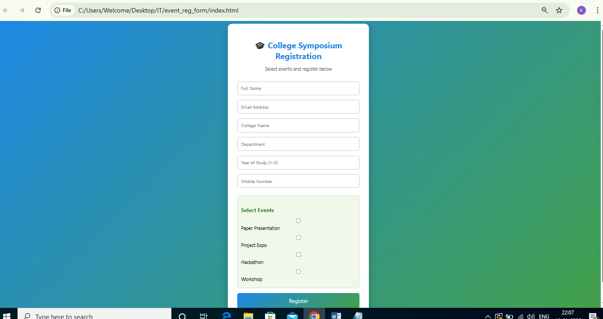

# multi-event-registration-form
A responsive and user-friendly college symposium registration form built using HTML, CSS, and JavaScript.  
The application allows participants to register for multiple events and stores registration details using browser localStorage.

## Preview

# Features
- Multi-event selection using checkboxes
- Client-side form validation
- Email and mobile number validation
- Stores multiple registrations in localStorage
- Clean and educational color-themed UI

# Technologies Used
- HTML
- CSS
- JavaScript

# How to Run the Project
1. Clone the repository or download the ZIP file.
2. Open `index.html` in any web browser.
3. Fill the form and submit to save registration details.

# Project Structure

# Data Storage
- Registration details are stored in browser local Storage as JSON objects.
- Data persists even after page refresh.

# Future Enhancements
- Display registered users in a table
- Export data to CSV
- Backend integration

# Author
Karthika Ramesh

